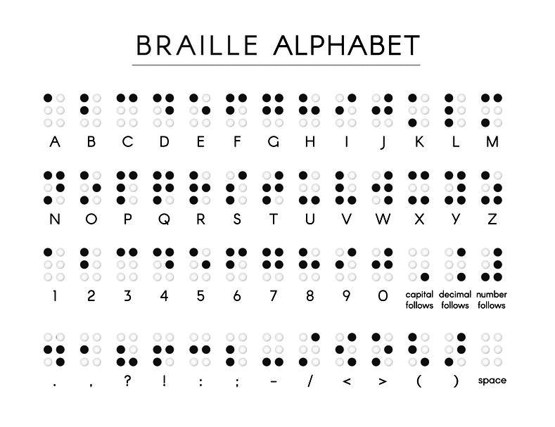

# Eng Intern Challenge Fall - Winter 2025

# **Note: In order for our submission automation to function correctly:**
1. **Your Github email must match the email you submitted your Application with (if your Github email is different, we recommend creating a new Github profile with the email you created your application with)**
2. **Have your email set to public on your Github Profile**
3. **Do not apply any labels on your PR. We will mark your PR as `reviewed` with a label when it has been so. Marking this yourself will cause your PR to be skipped.**

**If you have any questions, please reach out to `internprogram@shopify.com`**

---

## Braille Translator
In this coding challenge you will create a terminal / command-line application that can translate Braille to English and vice versa. 

The string to translate will be passed into your application as an argument at runtime. Your application must be smart enough to determine if the string given to it is either Braille or English and automatically convert it to the appropriate opposite. 

For the purposes of this challenge Braille must be displayed as `O` and `.` where `O` represents a raised dot. You must include the entire English alphabet, the ability to `capitalize` letters, add `spaces`, and the numbers `0` through `9` as well. 

After conversion, output the translated string--and nothing else--to the terminal. 

## What is Braille?
Braille (*/breɪl/ **BRAYL***) is a tactile writing system used by people who are visually impaired. Braille characters are formed using a combination of six raised dots arranged in a 3 × 2 matrix, called the braille cell. The number and arrangement of these dots distinguishes one character from another. ([via Wikipedia](https://en.wikipedia.org/wiki/Braille))

  

  <em style='font-size:xx-small;'>Black dots represent raised areas</em>

## Technical Requirements
- Translator
  - Given arguments passed into the program at runtime, determine if the given string should be translated to English or Braille.
  - For Braille, each character is stored as a series of `O` (the letter O) or `.` (a period).
  - Store Braille symbols as a 6 character string reading left to right, line by line, starting at the top left. See examples below.
  - When a Braille `capital follows` symbol is read, assume only the next symbol should be capitalized. 
  - When a Braille `number follows` symbol is read, assume all following symbols are numbers until the next `space` symbol.
- Braille Alphabet
  - Letters `a` through `z`
    - The ability to capitalize letters
  - Numbers `0` through `9`
  - The ability to include `spaces` ie: multiple words

## Examples
- Launching your application with English or Braille:
  - `ruby translator.rb Hello world`
  - `ruby translator.rb .....OO.OO..O..O..O.O.O.O.O.O.O..OO........OOO.OO..OO.O.OOO.O.O.O.OO.O..`
---
- Input: `Hello world`
- Output: `.....OO.OO..O..O..O.O.O.O.O.O.O..OO........OOO.OO..OO.O.OOO.O.O.O.OO.O..`
---
- Input: `42`
- Output: `.O.OOOOO.O..O.O...`
---
- Input: `.....OO.....O.O...OO...........O.OOOO.....O.O...OO....`
- Output: `Abc 123`

## Instructions
1. Fork this repo to your personal Github Account
1. Clone your forked repo to begin working on the challenge locally.
2. Create a new Branch in your repo where you will be pushing your code to.
3. Choose which programming language you wish to complete the challenge with.
    - Navigate to the folder of that programming language and complete your work in the `translator` file found inside. ie: `ruby/translator.rb`
    - **Do not** edit the test file in the folder. Tests will only work as intended after you have submitted a PR.
    - You'll find a separate `README.md` in that folder with language specific instructions.
4. Ensure your application is executable from the command-line by running your `translator` file.
5. Feel free to run the test found in your language folder to ensure your code is correct
6. Your application must output ***only*** the Braille/English string.
    - ie: `O.....` ***not*** `The Braille text is: O.....`

## Submission
Upon completion of the challenge, create a PR of your work and compare it against the original Assessment Repo's main branch. Submit a link to your PR in the "Take Home Submission Link" which was included in the Technical Challenge email instructions.

**Note: In order for our submission automation to function correctly:**
- Your Github email must match the email you submitted your Application with (if your Github email is different, we recommend creating a new Github profile with the email you created your application with)
- Have your email set to public on your Github Profile
- Do not apply any labels on your PR. We will mark your PR as `reviewed` with a label when it has been so. Marking this yourself will cause your PR to be skipped.

This repo is designed to run a unit test against your work to ensure the correct string is outputted to the console when executing your code. 
