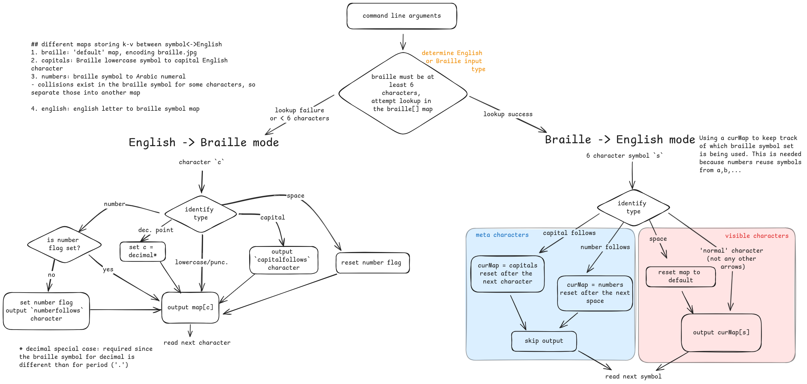

# Braille Translator

CLI tool to translate between English and Braille, written in Go.

## Usage

```go
go run translator.go INPUT
```

`INPUT` is a string in English or Braille (`O` for raised bumps and `.`). See characters outlined in [braille.jpg](../braille.jpg))

## Design

Diagram outlining the design for this tool is available under the `go/files/` directory



## Testing

```sh
go test translator_test.go
```

A simple testing harness `tests/run_tests.sh` runs the tool on each line in the `tests/test.in` file. Then, it displays and compares against the expected output in `tests/test.out`. The `nth` line in the input corresponds to the `nth` line in the output file.

To use these tests, from the `go/tests/` directory, run:

```sh
$ ./run-tests.sh
translated: .....OO......O.OOOO.....O.O...OO.... .....OO.OO..O..O..O.O.O.O.O.O.O..OO........OOO.OO..OO.O.OOO.O.O.O.OO.O.. .O.OOOOO.O..O.O... o > Abc 123
expected:   .....OO......O.OOOO.....O.O...OO.... .....OO.OO..O..O..O.O.O.O.O.O.O..OO........OOO.OO..OO.O.OOO.O.O.O.OO.O.. .O.OOOOO.O..O.O... o > Abc 123
Outputs match
```

## Assumptions/Notes

### Decimal Follows character

Since the [Wikipedia page](https://en.wikipedia.org/wiki/Braille) lists the pictured braille symbol as "decimal point", I interpreted this requirement as "in a number, such as `1.23`, output the `.` as `decimal point`, instead of `period`". Alternative interpretations could be "`1.23` should be translated to Braille symbols `<decimal follows> <1> <.> <2> <3>`, denoting the number after this symbol as a decimal"

### `<` `>` Angle Brackets

The `>` character's Braille symbol collides with the one for `o` (both are `O..OO.`). I chose to treat this symbol as `o` by default, unless the symbol was preceeded by `number follows`.

As a result, the value of `>` is not always preserved through repeated translations.

```sh
# preserved in a number context
$ go run translator.go "1>"
.O.OOOO.....O..OO.
$ go run translator.go ".O.OOOO.....O..OO."
1>
# not preserved in isolation
$ go run translator.go ">"
O..OO.
$ go run translator.go O..OO.
o
```

### Number follows

I assume English "words" (space-separated strings) are either entirely numbers or entirely letters.

For example, behavior for translating `A123a` is undefined/not preserved through repeated translations.

```sh
$ go run translator.go A123a
.....OO......O.OOOO.....O.O...OO....O.....
$ go run translator.go .....OO......O.OOOO.....O.O...OO....O.....
A1231
```
